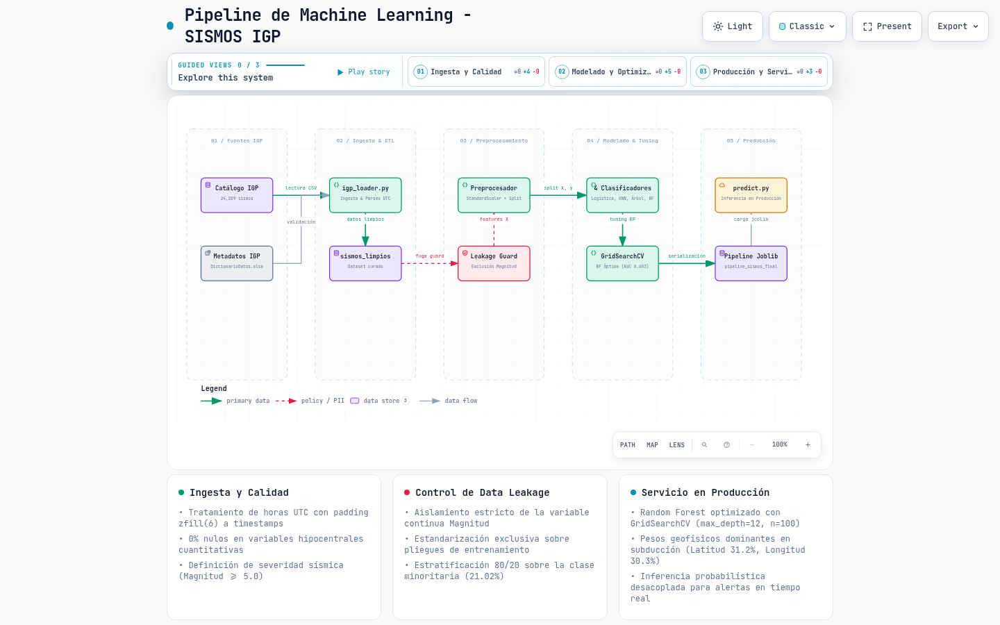

# Predicción y Modelado de Riesgo Sísmico en el Perú (IGP 1960–2025)

Sistema integral de ingeniería de datos, análisis exploratorio geoespacial y modelado predictivo de eventos sísmicos en el territorio peruano, desarrollado a partir del catálogo histórico oficial del **Instituto Geofísico del Perú (IGP)** que abarca el período 1960–2025 (24,289 observaciones registradas).

El proyecto implementa un pipeline reproducible de Machine Learning para clasificar sismos según su severidad geofísica (**Magnitud ≥ 5.0 Mw**) a partir de sus parámetros hipocentrales (coordenadas espaciales, profundidad y componente temporal), minimizando falsos negativos en zonas de alto riesgo de subducción.

---

## Estructura del Proyecto

La arquitectura sigue el estándar desacoplado de ingeniería de software y machine learning:

```text
SISMOS/
├── data/
│   ├── raw/
│   │   └── IGP/                                  # Datos brutos, diccionario y metadatos oficiales del IGP
│   │       ├── IGP_catalogo_sismico_1960_ 2025_Dataset.csv
│   │       ├── IGP_catalogo_sismicos_desde_1960_ DiccionarioDatos.xlsx
│   │       └── IGP_catalogo_sismicos_desde_1960_ Metadatos_0.docx
│   └── processed/
│       └── sismos_limpios.csv                    # Catálogo curado y validado (24,289 registros x 12 cols)
├── docs/                                         # Diagramas de arquitectura y flujo (Archify)
│   ├── pipeline_arquitectura.dataflow.json       # Especificación declarativa del pipeline
│   ├── pipeline_arquitectura.html                # Visor interactivo standalone (zoom, vistas y trazado)
│   ├── pipeline_arquitectura.png                 # Render gráfico para visualización en GitHub
│   └── pipeline_arquitectura.svg                 # Exportación vectorial SVG
├── models/
│   └── pipeline_sismos_final.joblib              # Pipeline productivo serializado (8.8 MB)
├── NOTEBOOKS/
│   ├── 01_auditoria_y_exploracion.ipynb          # Auditoría inicial de calidad y análisis exploratorio geoespacial
│   └── proyecto_integrador_sismos.ipynb          # Cuaderno integrador maestro: EDA, 4 modelos, CV, GridSearch e inferencia
├── sesiones/                                     # Trazabilidad técnica y bitácoras de trabajo colaborativo
│   ├── sesion_back.md                            # Bitácora de Backend & Data Engineering
│   ├── sesion_kiara.md                           # Bitácora de Jupyter Environment, EDA & Modelado Integrador
│   └── sesion_learner.md                         # Bitácora de orquestación pedagógica y contexto del equipo
├── src/
│   ├── data/
│   │   └── igp_loader.py                         # Pipeline modular de ingesta, limpieza y exportación
│   └── models/
│       └── predict.py                            # Script de inferencia en producción con cálculo probabilístico
├── README.md                                     # Documentación técnica principal del proyecto
└── requirements.txt                             # Dependencias del entorno Python
```

---

## Flujo Metodológico y Arquitectura del Pipeline

<p align="center">
  
</p>

> 💡 **Diagrama Interactivo (Archify):** Puedes explorar este diagrama con navegación interactiva, inspección de nodos, vistas temáticas y trazado de flujo abriendo [`docs/pipeline_arquitectura.html`](docs/pipeline_arquitectura.html) directamente en tu navegador.

```mermaid
flowchart LR
    A["Catálogo Crudo IGP<br/>(CSV 24,289 reg)"] --> B["src/data/igp_loader.py<br/>(Padding HORA_UTC, datetimes)"]
    B --> C["data/processed/sismos_limpios.csv"]
    C --> D["Partición Estratificada 80/20<br/>(Aislamiento de MAGNITUD)"]
    D --> E["ColumnTransformer<br/>(StandardScaler)"]
    E --> F["Entrenamiento & 5-Fold CV<br/>(Logística, KNN, Árbol, RF)"]
    F --> G["GridSearchCV Optimización<br/>(Random Forest líder)"]
    G --> H["models/pipeline_sismos_final.joblib"]
    H --> I["src/models/predict.py<br/>(Inferencia en Producción)"]
```



1. **Ingesta y Limpieza de Datos (`src/data/igp_loader.py`):**
   - Lectura con separador `;` y normalización de encabezados.
   - Reconstrucción de `HORA_UTC` numérica con relleno de ceros a la izquierda (`zfill(6)`) y combinación con `FECHA_UTC` para generar la variable timestamp `FECHA_HORA`.
   - Control de calidad geofísica: validación de coordenadas y restricciones físicas (`PROFUNDIDAD ≥ 0`, `MAGNITUD > 0`).
   - Generación de la variable objetivo binaria: **`SISMO_SEVERO` = 1** para **`MAGNITUD` ≥ 5.0**, y **0** en caso contrario.

2. **Control Estricto de Fuga de Información (*Data Leakage*):**
   - Se excluye explícitamente la columna continua `MAGNITUD` del conjunto de variables predictoras $X$, dado que es el origen matemático del target.
   - Variables predictoras seleccionadas ($X$): `['LATITUD', 'LONGITUD', 'PROFUNDIDAD', 'HORA']`.

3. **Preprocesamiento Desacoplado:**
   - Implementación de `ColumnTransformer` con `StandardScaler` embebido en `Pipeline` de Scikit-Learn.
   - El escalado se ajusta exclusivamente en los pliegues de entrenamiento, evitando cualquier contaminación hacia el conjunto de prueba o validación.

4. **Tratamiento del Desbalance de Clases:**
   - La distribución histórica es de **78.98% leves/moderados** ($19,184$ eventos) vs **21.02% severos** ($5,105$ eventos).
   - Se emplean pesos balanceados (`class_weight='balanced'`) y partición estratificada (`StratifiedKFold`).
   - Métrica principal de decisión: **Recall** de sismos severos (para minimizar falsos negativos críticos) y **ROC-AUC**.

---

## Tabla Comparativa de Rendimiento

Evaluación de los 4 clasificadores del currículo sobre el conjunto de test ($4,858$ eventos) y validación cruzada estratificada de 5 pliegues:

| Modelo Evaluado | Accuracy | Precision (Severo) | Recall (Severo) | F1-Score (Severo) | ROC-AUC (Test) | ROC-AUC (5-Fold CV) |
| :--- | :---: | :---: | :---: | :---: | :---: | :---: |
| **Regresión Logística** | 0.546 | 0.227 | 0.484 | 0.309 | 0.531 | $0.546 \pm 0.010$ |
| **KNN ($k=7$)** | **0.768** | 0.289 | 0.070 | 0.112 | 0.560 | $0.559 \pm 0.009$ |
| **Árbol de Decisión** | 0.509 | 0.229 | **0.563** | 0.326 | 0.541 | $0.566 \pm 0.012$ |
| **Random Forest (Ganador)** | 0.676 | **0.300** | 0.405 | **0.344** | **0.603** | **$0.601 \pm 0.015$** |

> **Conclusión técnica:** Aunque KNN exhibe un alto *Accuracy* global (0.768), sufre un colapso en la clase minoritaria (Recall de 0.070, ignorando prácticamente los sismos severos). **Random Forest** es seleccionado como el clasificador óptimo por su balance global superior, estabilidad en validación cruzada y el valor más alto de **ROC-AUC (0.603)**.

---

## Optimización e Importancia de Variables

### 1. Búsqueda de Hiperparámetros (GridSearchCV)
Se optimizó el modelo líder mediante `GridSearchCV` evaluando combinaciones sobre `n_estimators`, `max_depth` y `min_samples_split` maximizando `scoring='roc_auc'` en 5-Fold Stratified CV:
- **Mejores hiperparámetros encontrados:**
  - `n_estimators`: `100`
  - `max_depth`: `12`
  - `min_samples_split`: `2`
  - `class_weight`: `'balanced'`

### 2. Importancia Geofísica de las Variables (`feature_importances_`)
La extracción de pesos de contribución en el ensamble confirma la física de la zona de subducción entre la Placa de Nazca y la Placa Sudamericana:

| Variable | Peso Relativo | Interpretación Geofísica |
| :--- | :---: | :--- |
| **LATITUD** | **31.24%** | Segmentación longitudinal del contacto entre placas tectónicas en el Perú. |
| **LONGITUD** | **30.33%** | Distancia perpendicular a la fosa marina (fosa de subducción frente a la costa). |
| **PROFUNDIDAD** | **25.24%** | Diferenciación entre eventos corticales superficiales y eventos profundos del manto. |
| **HORA** | **13.19%** | Ruido de fondo y patrones de resolución instrumental de la red sísmica. |

> Más del **86.8%** del poder predictivo del ensamble proviene exclusivamente de la posición tridimensional del hipocentro (`LATITUD`, `LONGITUD`, `PROFUNDIDAD`).

---

## Instrucciones de Instalación y Reproducción

### 1. Clonar el repositorio y configurar el entorno
```bash
cd /home/pierooo/Projects/ai_model/SISMOS

# Instalar dependencias
pip install -r requirements.txt
```

### 2. Registrar el kernel interactivo (para VS Code / Jupyter)
```bash
python3 -m ipykernel install --user --name python3 --display-name "Python 3 (ipykernel)"
```

### 3. Ejecutar el pipeline de ingesta y preparación
Para reprocesar el catálogo crudo y generar `data/processed/sismos_limpios.csv`:
```bash
python3 src/data/igp_loader.py
```

### 4. Ejecución de los Notebooks
Los cuadernos se encuentran en `NOTEBOOKS/` y pueden abrirse interactivamente en VS Code o ejecutarse desde la terminal:
```bash
cd NOTEBOOKS

# Ejecutar el análisis exploratorio inicial
python3 -m jupyter nbconvert --to notebook --execute 01_auditoria_y_exploracion.ipynb --inplace

# Ejecutar el cuaderno maestro integrador (entrena y serializa el modelo)
python3 -m jupyter nbconvert --to notebook --execute proyecto_integrador_sismos.ipynb --inplace
```

### 5. Inferencia en Producción (`src/models/predict.py`)
El módulo carga el pipeline entrenado (`models/pipeline_sismos_final.joblib`) y ejecuta la predicción probabilística:
```bash
python3 src/models/predict.py
```

**Ejemplo de uso programático en Python:**
```python
from src.models.predict import cargar_modelo, predecir_sismo

# Cargar el pipeline optimizado
modelo = cargar_modelo()

# Evaluar un nuevo evento frente a la costa de Lima
resultado = predecir_sismo(
    modelo=modelo,
    latitud=-12.05,
    longitud=-77.04,
    profundidad=35.0,
    hora=14,
    mes=6
)

print(resultado)
# Salida esperada:
# {
#   'parametros_entrada': {'latitud': -12.05, 'longitud': -77.04, 'profundidad_km': 35.0, ...},
#   'es_severo': 0,
#   'etiqueta': 'LEVE / MODERADO (Magnitud < 5.0)',
#   'probabilidad_severo': 0.4672,
#   'probabilidad_no_severo': 0.5328
# }
```
